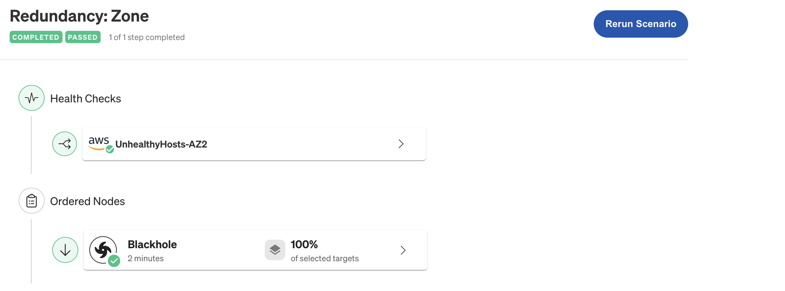
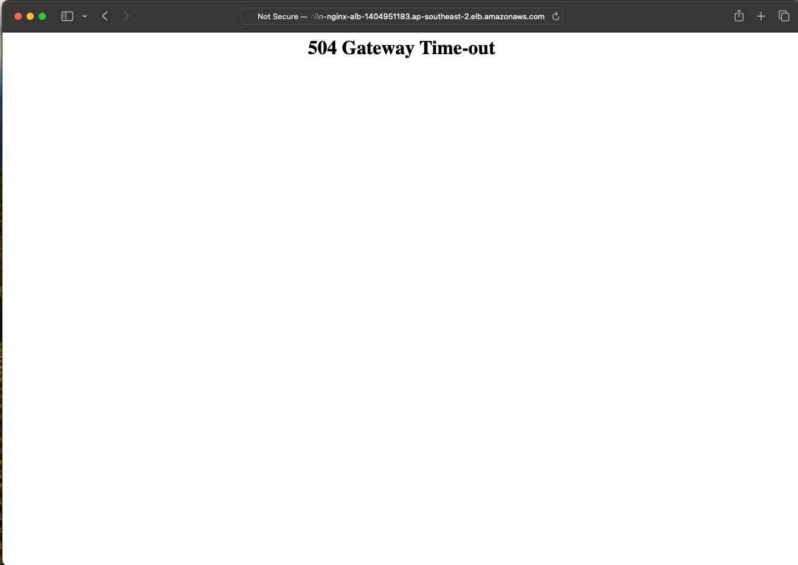
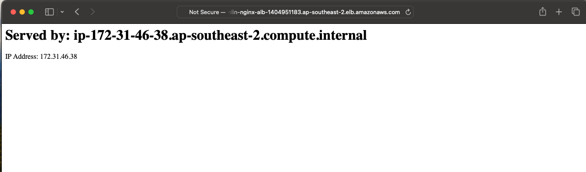
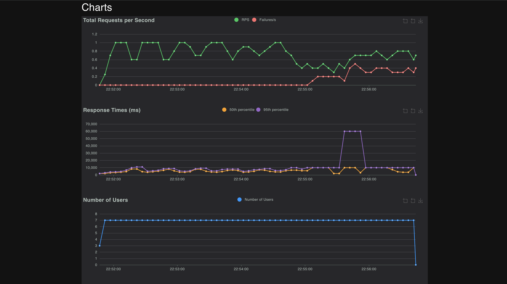

# ⚙️ Chaos Engineering on AWS using Gremlin, Locust , CloudWatch Python Server, ALB, and Load Testing

> **This project showcases a full-stack approach to injecting chaos into AWS infrastructure using [Gremlin](https://www.gremlin.com/), validating failover through [CloudWatch](https://docs.aws.amazon.com/cloudwatch/), and analyzing system resilience under pressure with [Locust](https://locust.io/).**

---

---

## 🛠️ How to Run the Project

### 1. 🧱 Set Up AWS Infrastructure
Provision VPC, subnets, EC2 instances, NAT gateway, and Load Balancer using:
- 📄 [`SetUp_Env_Test/aws-resource-setup.md`](SetUp_Env_Test/aws-resource-setup.md)

### 2. 🐍 Deploy Python HTTP Server
Run a lightweight web server in private subnets (refer [`python-server/app.md`](python-server/app.md)).

### 3. 🔁 Load Testing with Locust
Use [`locust/locustfile.py`](locust/locustfile.py) to simulate traffic and test the resiliency of the application.

### 4. 💣 Chaos Testing with Gremlin
Inject availability zone or region-level chaos via:
- 📄 [`simulate-zone:region-failure.yaml`](SetUp_Env_Test/simulate-zone:region-failure.yaml)

### 5. 📉 Monitor System Health
Use AWS **CloudWatch** to observe:
- Latency spikes
- 5xx error responses
- CPU and memory usage
- Availability zone impact

---

## 📊 Screenshots

| Scenario                          | Screenshot                              |
|----------------------------------|------------------------------------------|
| Gremlin Chaos Injection          |      |
| 502 Gateway Error                |      |
| Server Response During Failover  |       |
| Test Result Chart                |      |

---

## 💡 Learnings & Use Cases

- ✅ Understand how applications behave under cloud infrastructure stress.
- ✅ Test load balancer failover handling.
- ✅ Monitor recovery time and impact metrics.
- ✅ Practice chaos engineering in a safe, controlled environment.

---

## 🧱 Tech Stack

- **AWS**: EC2, VPC, Subnets, ALB, IAM, CloudWatch
- **Gremlin**: Chaos injection (AZ & region failure)
- **Locust**: Load testing framework
- **Python**: Simple Flask-style HTTP server
- **Bash / AWS CLI**: Infrastructure provisioning

