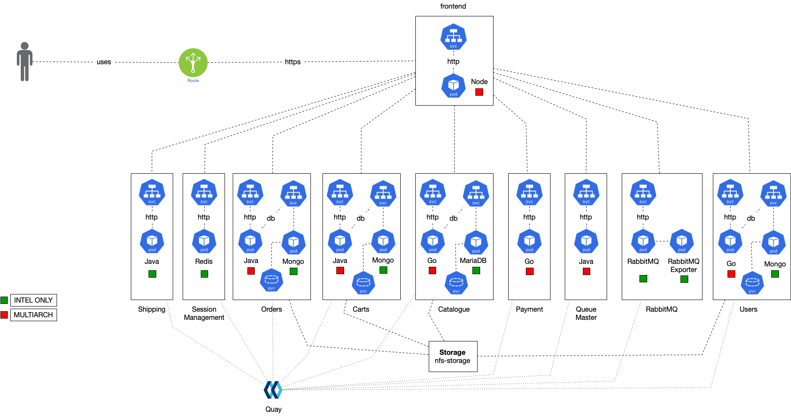
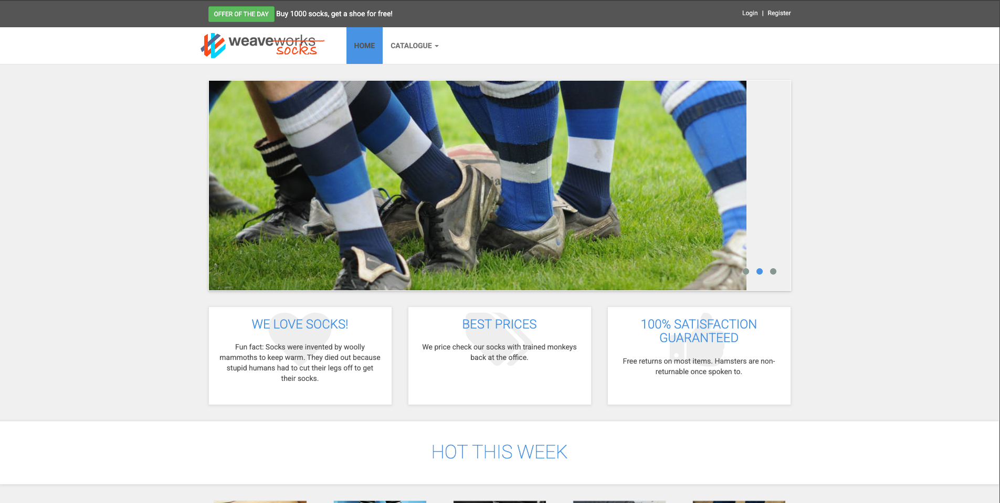

# 🔪 Minikube on local server with Docker & Sock Shop Microservices

This guide helps you set up a Kubernetes cluster using Minikube with Docker on an Ubuntu instance, and deploy the **Sock Shop** microservices application.

---

## 📦 Prerequisites

- EC2 Ubuntu 20.04+ or local server
- Internet access from EC2
- GitHub CLI or manual repo creation to push this README

---

## 🔧 Step 1: Install Minikube

```bash
curl -LO https://storage.googleapis.com/minikube/releases/latest/minikube-linux-amd64
sudo install minikube-linux-amd64 /usr/local/bin/minikube
```
> 📌 Downloads the Minikube binary and installs it in your system path.

---

## 🐳 Step 2: Install Docker (Container Runtime)

```bash
curl -fsSL https://download.docker.com/linux/ubuntu/gpg | sudo apt-key add -
sudo add-apt-repository \
  "deb [arch=amd64] https://download.docker.com/linux/ubuntu \
  $(lsb_release -cs) stable"
sudo apt-get update
apt-cache policy docker-ce
sudo apt-get install docker-ce docker-ce-cli containerd.io
sudo systemctl status docker
```

> 📌 Installs Docker and its dependencies on Ubuntu.

Then, allow your user to run Docker commands without `sudo`:

```bash
sudo usermod -aG docker ubuntu && newgrp docker
```

---

## ⎈ Step 3: Install `kubectl` CLI

```bash
sudo snap install kubectl --classic
```

> 📌 Installs the Kubernetes command-line tool to manage your cluster.

---

## 🚀 Step 4: Start Minikube with Docker Driver

```bash
minikube start --driver=docker
```

> 📌 Launches a single-node Kubernetes cluster using Docker as the container runtime.

---

## 🧼 Step 5: Clean Up Old Resources (Optional)

If you've deployed something previously and it’s not working as expected:

```bash
minikube delete
```

> 📌 Deletes all running Minikube resources and resets the cluster.

---

## 🛠 Step 6: Deploy Sock Shop Microservices

```bash
kubectl create namespace sock-shop
kubectl -- apply -f https://github.com/weaveworks/weave/releases/download/v2.8.1/weave-daemonset-k8s.yaml
kubectl apply -f https://github.com/microservices-demo/microservices-demo/releases/download/0.3.5/deploy.yaml -n sock-shop

```

> 📌 This deploys the entire Sock Shop demo architecture inside the `sock-shop` namespace.

---

## 🌐 Step 7: Access the Front-End Service

1. Find the **Minikube IP**:
    ```bash
    minikube ip
    ```

2. Get the **NodePort** of the front-end service:
    ```bash
    kubectl get svc -n sock-shop
    ```

3. Access the app:
    ```
    http://<minikube-ip>:<node-port>
    ```

️ **Important:** If you're running Minikube on an EC2 instance, the Minikube IP is not accessible from outside directly.


---

## ✅ Final Status Check

To verify everything is running:
```bash
kubectl get pods -n sock-shop
```

---

## 🪡 Cleanup (When you're done)

```bash
minikube stop
minikube delete
```

---
## 📐 Architecture Diagram


## 🧰 Tech Stack



---

## 🚀 Application Overview



