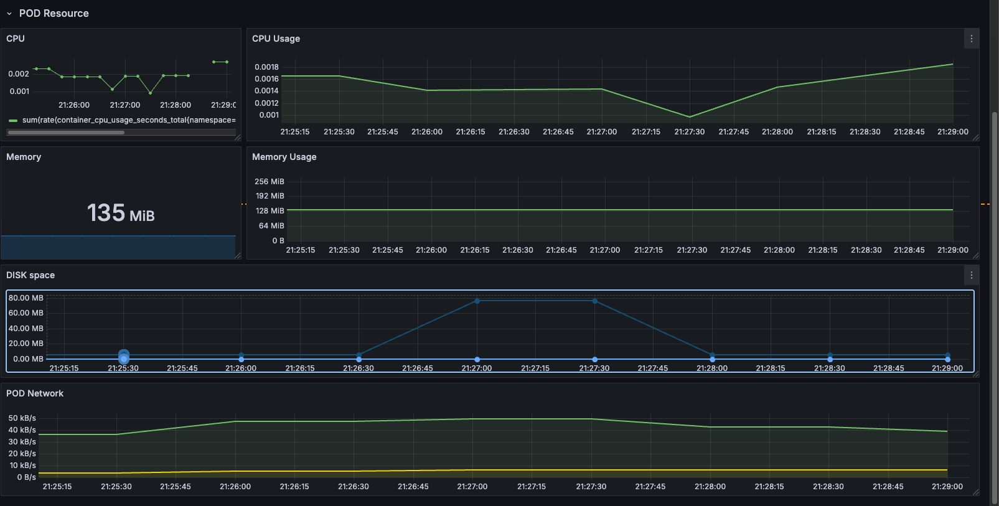
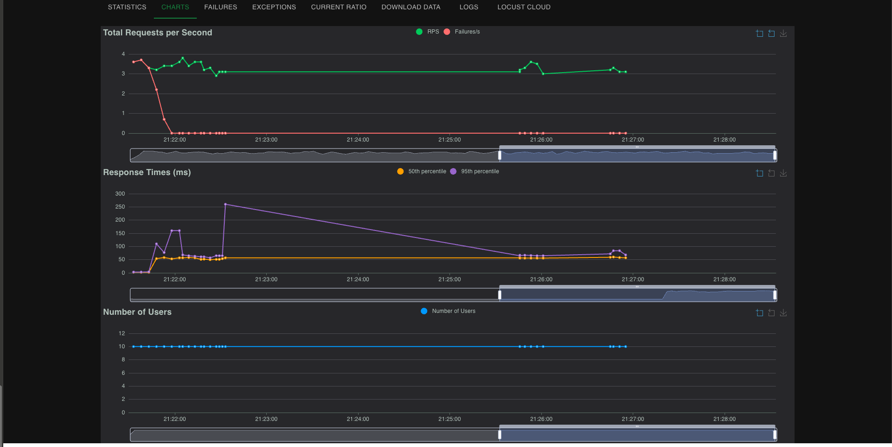

The Disk Fill Chaos Test is used to simulate a scenario where disk space is exhausted on a container or node. This helps verify how resilient the application is under low disk conditions and whether it can handle failures gracefully. In this test, we target the frontend service running in Minikube and fill up the disk space to observe its behavior and stability.

